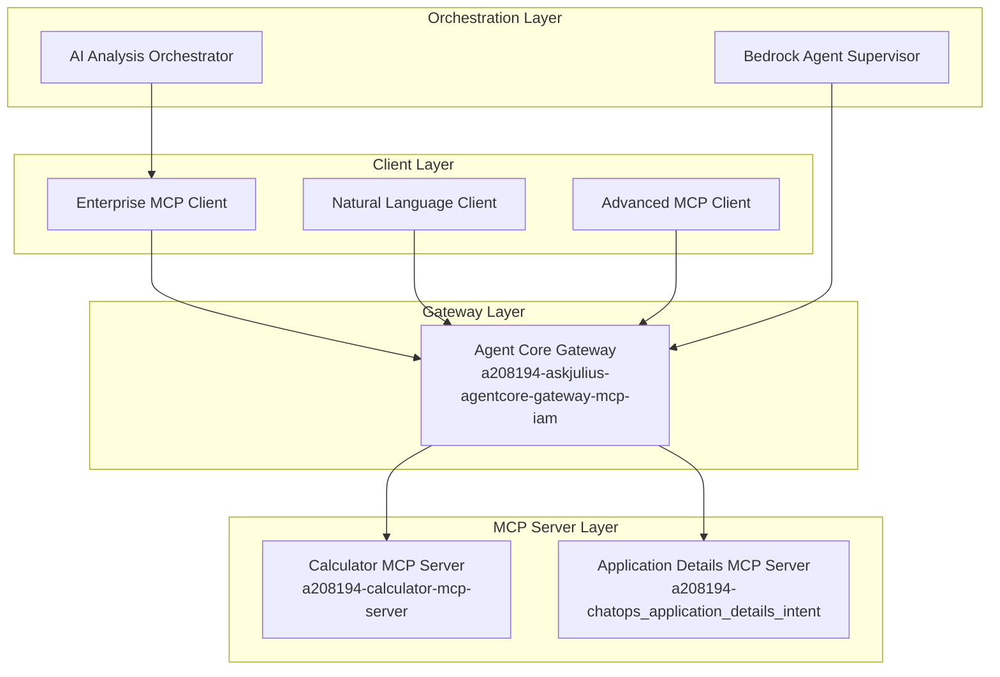

# Enterprise MCP Architecture Mapping
## Project: a208194-askjulius-agentcore-gateway-mcp-iam

### 🏗️ **ARCHITECTURE OVERVIEW**



---

## 📋 **COMPONENT IDENTIFICATION**

### **1. MCP CLIENTS** 🖥️
**Definition**: Client applications that consume MCP services

| Component | File | Role | Status |
|-----------|------|------|--------|
| **Enterprise MCP Client** | `enterprise_mcp_client.py` | AI-powered natural language interface | ✅ Active |
| **Natural Language Client** | `multi_tool_mcp_client_natural.py` | Screenshot-style interface | ✅ Working |
| **Advanced Calculator Client** | `advanced_mcp_client.py` | Comprehensive math with memory | ✅ Working |
| **Application Details Client** | `application_details_mcp_client.py` | Dedicated app details interface | ⚠️ Needs MCP format |

---

### **2. MCP SERVERS** 🔧
**Definition**: Lambda functions that implement MCP protocol and provide tools

| Component | Function Name | Tool Provided | Status |
|-----------|---------------|---------------|--------|
| **Calculator MCP Server** | `a208194-calculator-mcp-server` | Mathematical operations | ✅ **Working** |
| **Application Details MCP Server** | `a208194-chatops_application_details_intent` | Asset information lookup | ❌ **Needs MCP Format** |

**Working MCP Server Pattern** (Calculator):
```python
def lambda_handler(event, context):
    # MCP-compatible response format
    return [
        {
            "type": "text",
            "text": f"Result: {calculation_result}"
        }
    ]
```

**Problematic Server Pattern** (App Details):
```python
def lambda_handler(event, context):
    # Traditional Lambda response - NOT MCP compatible
    return {
        "statusCode": 200,
        "body": json.dumps({"data": "..."})
    }
```

---

### **3. GATEWAY** 🌐
**Definition**: Central routing and protocol translation layer

| Component | Gateway Name | URL |
|-----------|--------------|-----|
| **Agent Core Gateway** | `a208194-askjulius-agentcore-gateway-mcp-iam` | `https://a208194-askjulius-agentcore-gateway-mcp-iam-fvro4phd59.gateway.bedrock-agentcore.us-east-1.amazonaws.com/mcp` |

**Gateway Configuration** (from your script):
```json
{
    "gatewayName": "a208194-askjulius-agentcore-gateway-mcp-iam",
    "targets": [
        {
            "targetName": "a208194-application-details-tool-target",
            "targetConfiguration": {
                "type": "MCP",
                "mcp": {
                    "lambda": {
                        "lambdaArn": "arn:aws:lambda:us-east-1:818565325759:function:a208194-chatops_application_details_intent"
                    }
                }
            }
        }
    ]
}
```

---

### **4. SUPERVISOR AGENT** 🤖
**Definition**: High-level AI orchestrator that manages multiple capabilities

| Component | Role | Implementation |
|-----------|------|----------------|
| **Bedrock Agent Supervisor** | Coordinates multiple MCP servers through gateway | **Implicit** - via Bedrock Agent Core |
| **AI Analysis Orchestrator** | Provides natural language understanding | **Embedded** in Enterprise Client |

**Enterprise Pattern**:
```python
class BedrockModelManager:
    """AI Supervisor for natural language analysis"""
    def get_model_response(self, user_input):
        # Claude 3.5 Sonnet analysis
        # Determines operation type and confidence
        # Routes to appropriate MCP server
```

---

### **5. ORCHESTRATOR AGENT** 🎭
**Definition**: Workflow coordinator that manages multi-step operations

| Component | Scope | Implementation |
|-----------|-------|----------------|
| **Memory Manager** | Cross-session state management | `bedrock_agentcore_starter_toolkit.operations.memory.manager` |
| **Multi-Tool Coordinator** | Combines calculator + app details | **Enterprise MCP Client** |
| **Workflow Orchestrator** | Complex business logic coordination | **Future Implementation** |

---

## 🔍 **CURRENT ARCHITECTURE STATUS**

### **✅ WORKING COMPONENTS**
1. **MCP Client Layer**: All clients functional
2. **Gateway**: Properly configured and routing
3. **Calculator MCP Server**: Returns MCP-compatible responses
4. **Authentication**: SigV4 working correctly

### **❌ ISSUES IDENTIFIED**
1. **Application Details MCP Server**: Returns traditional Lambda format instead of MCP format
2. **Response Format Mismatch**: Causes "internal error" at gateway

### **🎯 ENTERPRISE RECOMMENDATIONS**

#### **Immediate Actions**:
1. **Create MCP-Compatible App Details Server**:
   ```bash
   # New function name
   a208194-application-details-mcp-server
   ```

2. **Maintain Separation of Concerns**:
   ```
   Calculator Operations → a208194-calculator-mcp-server
   App Details Lookup  → a208194-application-details-mcp-server  
   User Management     → a208194-user-management-mcp-server (future)
   ```

3. **Update Gateway Target**:
   ```bash
   # In your script, change:
   LAMBDA_ARN="arn:aws:lambda:us-east-1:818565325759:function:a208194-application-details-mcp-server"
   ```

#### **Enterprise Best Practices**:
- **One MCP Server per business domain**
- **Consistent MCP response format across all servers**
- **Gateway as single point of authentication and routing**
- **Client layer handles natural language → structured calls**
- **Supervisor/Orchestrator for complex multi-step workflows**

---

## 📊 **TOOL NAMING CONVENTION**

Your gateway uses this pattern:
```
target-{TARGET_NAME}___{TOOL_NAME}

Examples:
- target-calculator___calculate
- target-a208194-application-details-tool-target___get_application_details
```

---

## 🚀 **NEXT STEPS**

1. **Create MCP-compatible Application Details Server** based on working calculator pattern
2. **Update gateway configuration** to point to new MCP server
3. **Implement enterprise orchestrator** for complex workflows
4. **Add monitoring and observability** across all components

This enterprise architecture follows industry best practices for:
- **Microservices separation**
- **API gateway pattern** 
- **Event-driven architecture**
- **AI-powered orchestration**